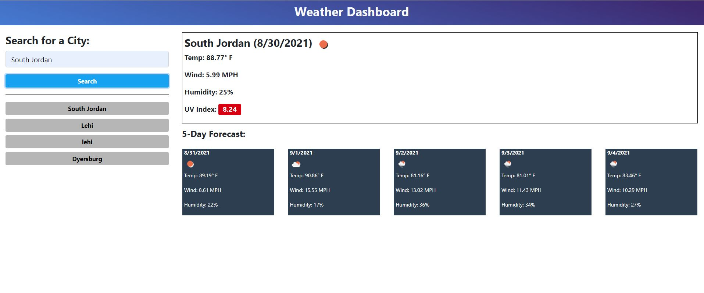

Weather Dashboard

This weather dashboard allows the user to search for weather by city.  It will display, the current temp, windspeed in mph, humdity %, and UV Index.  It will also display a five day forcast.  Local storage will record the cities searched and will list previously serached cities under the search form on the left-hand side of the page. The User will be able to click on the previously searched cities to retrieve the current information for that city.

These files for this project can be found in the following location:

* [GitHub Repsoitory](https://github.com/rgfitzhugh/weather-dashboard)

To access the Weather Dashboard directly visit:

* [Weather Dashboard Url](https://rgfitzhugh.github.io/weather-dashboard/)

